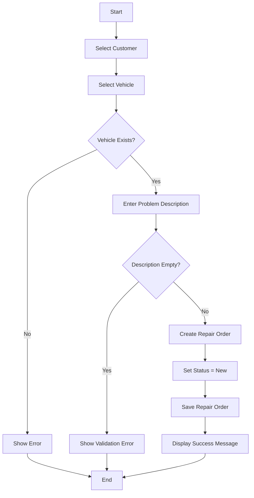

# Repair Order Creation Flow

```mermaid
flowchart TD

A[Start] --> B[Select Customer]
B --> C[Select Vehicle]

C --> D{Vehicle Exists?}

D -->|No| E[Show Error]
E --> Z[End]

D -->|Yes| F[Enter Problem Description]

F --> G{Description Empty?}

G -->|Yes| H[Show Validation Error]
H --> Z

G -->|No| I[Create Repair Order]

I --> J[Set Status = New]

J --> K[Save Repair Order]

K --> L[Display Success Message]

L --> Z[End]
```
