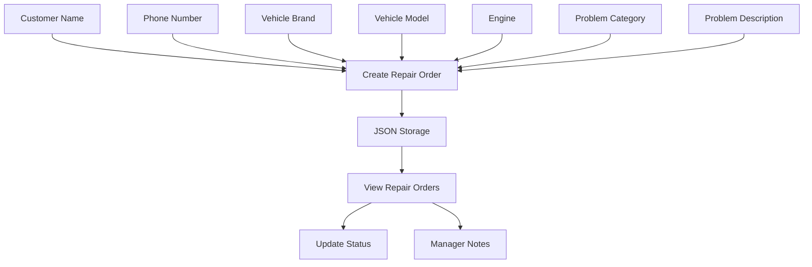

# Repair Order Management Flow

```mermaid
flowchart TD

    A[Customer Name]
    B[Phone Number]

    C[Vehicle Brand]
    D[Vehicle Model]
    E[Engine]

    F[Problem Category]
    G[Problem Description]

    H[Create Repair Order]

    I[JSON Storage]

    J[View Repair Orders]

    K[Update Status]
    L[Manager Notes]

    A --> H
    B --> H

    C --> H
    D --> H
    E --> H

    F --> H
    G --> H

    H --> I

    I --> J

    J --> K
    J --> L
```